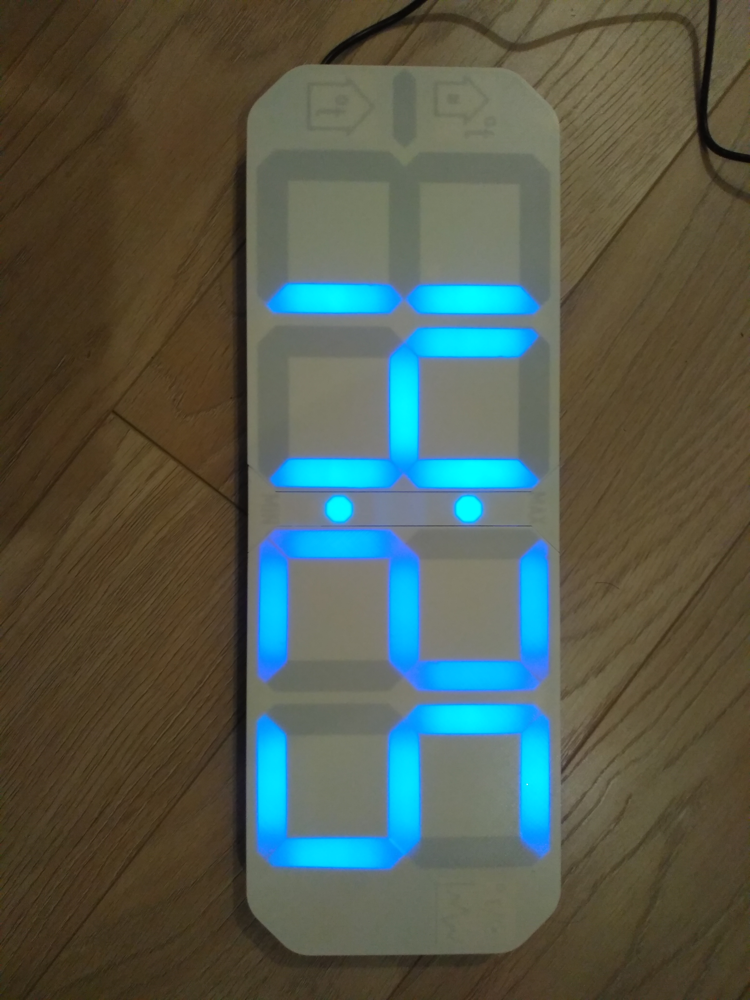
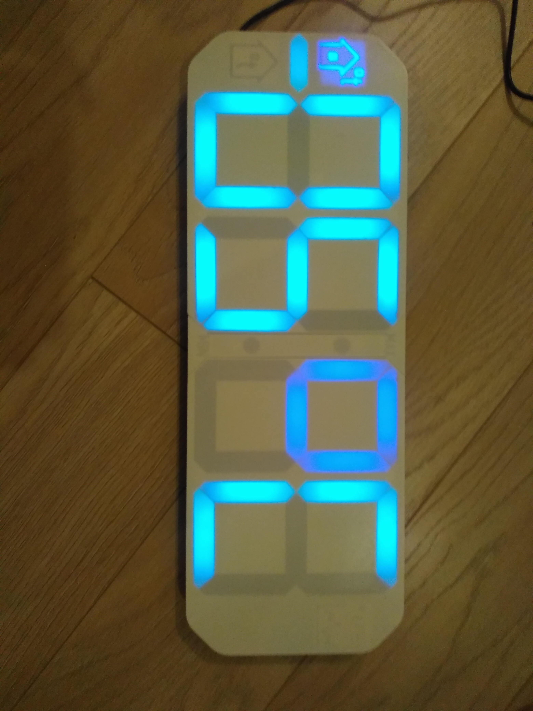

## LedClock

### Прошивка для часов с семисегментным экраном, выполненным на адресных светодиодах.

Задача - разработка часов для пожилого, слабовидящего человека. С курупным циферблатом, и возможность настраивать цвет. 
В итоге получилась такая штука:

Это уже третяя версия часов, потому, в ней добавлениы некоторые приятные мелочи. А именно возможность отображения температуры.



Есть два источника температуры:
- Датчик на борту
- Удалённый датчик, передающий данные по радио сигналу

Весь основной функцианал часов сосредаточен в библиотеке LedClockOn7Segments. Она реализованна таким образом, что бы можно было легко её применять с разным оборудыванием (такими как часы точного времени, датчики, кнопки и т.п.) и разными библиотеками.
Пример:

```Cpp
    //привязываем фунцию которая опрашивает часы
    ledClock.attachGetTimeFunction(updateTime); 
```
```Cpp
    /*
    Здесь, rtc - это обёект для работы с модулем реально времени MicroDS3231 
    А мог быть любой другой.
    */
    void updateTime(){  
    
        ledClock.setCurTime(
            (byte)rtc.getDay(), 
            (byte)rtc.getHours(), 
            (byte)rtc.getMinutes(), 
            (byte)rtc.getSeconds());
    }
```


Использует сторонние библиотеки.

Проект выполнен в PlatformIo.
